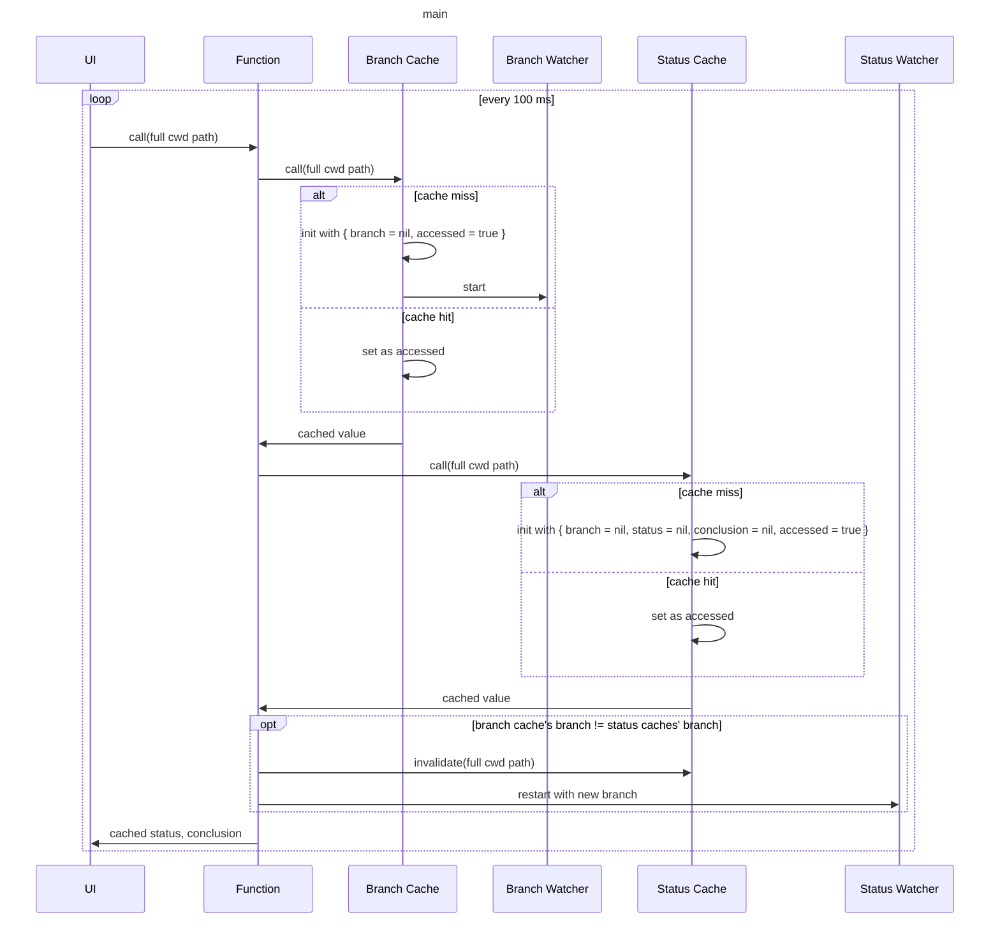
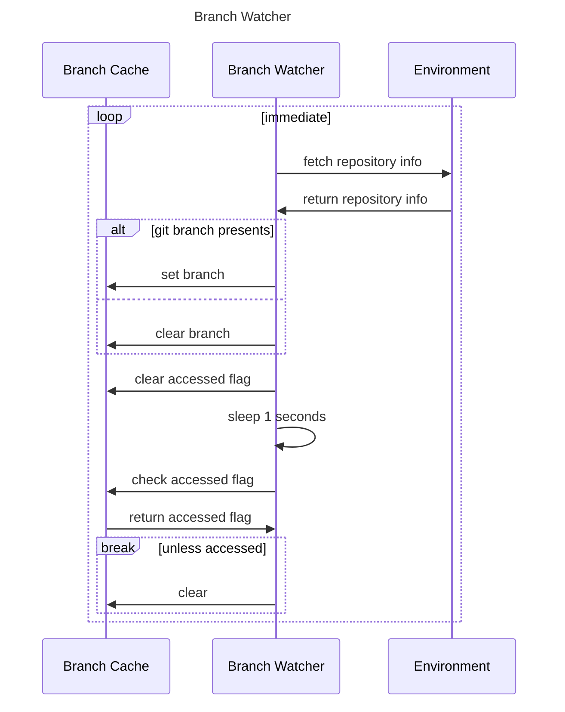
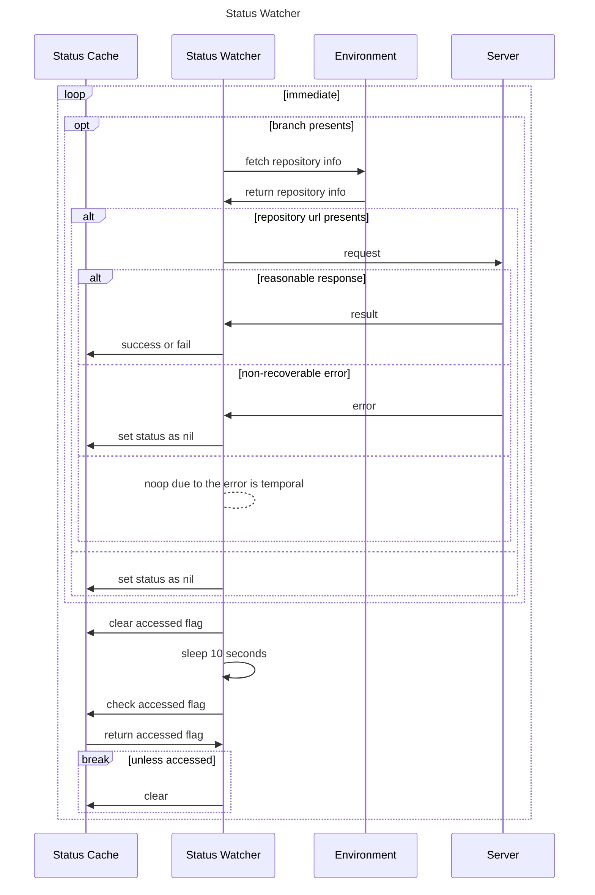

```mermaid
---
title: main
---
sequenceDiagram
    loop every 100 ms
        UI->>Function: call(full cwd path)
        Function->>Branch Cache: call(full cwd path)
        alt cache miss
            Branch Cache->>Branch Cache: init with { branch = nil, accessed = true }
            Branch Cache->>Branch Watcher: start
        else cache hit
            Branch Cache->>Branch Cache: set as accessed
        end
        Branch Cache->>Function: cached value

        Function->>Status Cache: call(full cwd path)
        alt cache miss
            Status Cache->>Status Cache: init with { branch = nil, status = nil, conclusion = nil, accessed = true }
        else cache hit
            Status Cache->>Status Cache: set as accessed
        end
        Status Cache->>Function: cached value

        opt branch cache's branch != status caches' branch
            Function->>Status Cache: invalidate(full cwd path)
            Function->>Status Watcher: restart with new branch
        end

        Function->>UI: cached status, conclusion
    end
```

```mermaid
---
title: Branch Watcher
---
sequenceDiagram
    participant Branch Cache
    participant Branch Watcher
    participant Environment
    loop immediate
        Branch Watcher->>Environment: fetch repository info
        Environment->>Branch Watcher: return repository info
        alt git branch presents
            Branch Watcher->>Branch Cache: set branch
        else
            Branch Watcher->>Branch Cache: clear branch
        end
        Branch Watcher->>Branch Cache: clear accessed flag
        Branch Watcher->>Branch Watcher: sleep 1 seconds
        Branch Watcher->>Branch Cache: check accessed flag
        Branch Cache->>Branch Watcher: return accessed flag
        break unless accessed
            Branch Watcher->>Branch Cache: clear
        end
    end
```

```mermaid
---
title: Status Watcher
---
sequenceDiagram
    participant Status Cache
    participant Status Watcher
    participant Environment
    participant Server
    loop immediate
        opt branch presents
            Status Watcher->>Environment: fetch repository info
            Environment->>Status Watcher: return repository info
            alt repository url presents
                Status Watcher->>Server: request
                alt reasonable response
                    Server->>Status Watcher: result
                    Status Watcher->>Status Cache: success or fail
                else non-recoverable error
                    Server->>Status Watcher: error
                    Status Watcher->>Status Cache: set status as nil
                else
                    Status Watcher-->Status Watcher: noop due to the error is temporal
                end
            else
                Status Watcher->>Status Cache: set status as nil
            end
        end
        Status Watcher->>Status Cache: clear accessed flag
        Status Watcher->>Status Watcher: sleep 10 seconds
        Status Watcher->>Status Cache: check accessed flag
        Status Cache->>Status Watcher: return accessed flag
        break unless accessed
            Status Watcher->>Status Cache: clear
        end
    end
```
