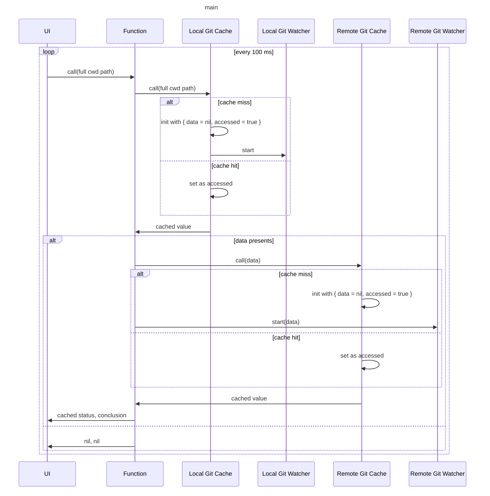
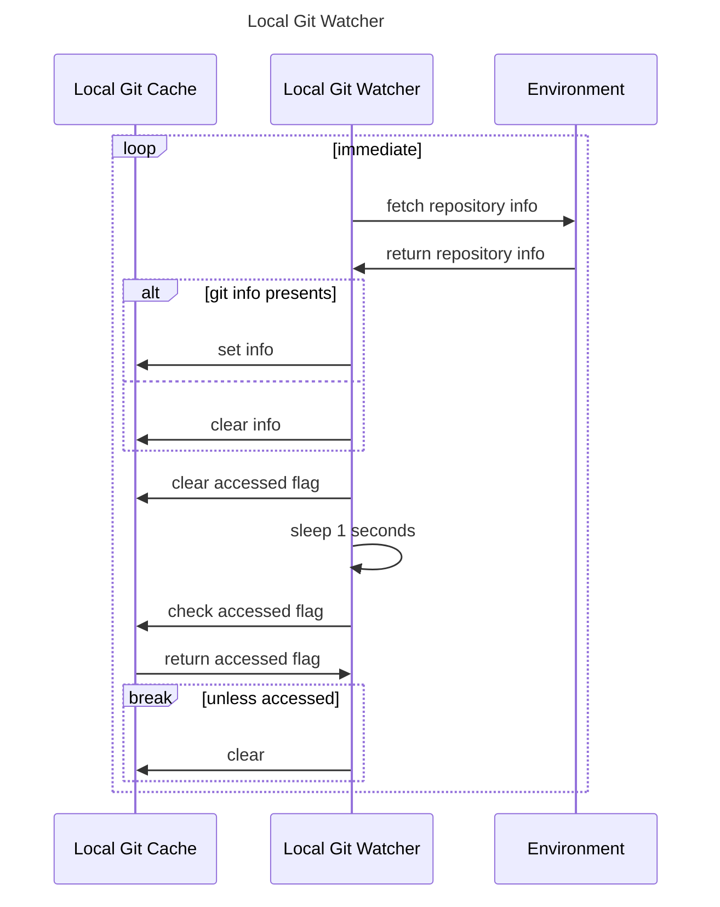
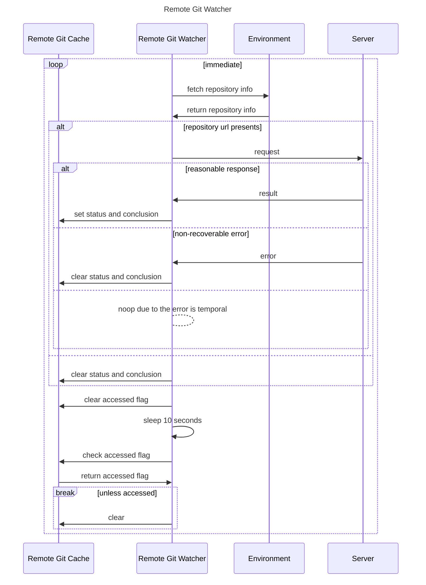

```mermaid
---
title: main
---
sequenceDiagram
    loop every 100 ms
        UI->>Function: call(full cwd path)
        Function->>Local Git Cache: call(full cwd path)
        alt cache miss
            Local Git Cache->>Local Git Cache: init with { data = nil, accessed = true }
            Local Git Cache->>Local Git Watcher: start
        else cache hit
            Local Git Cache->>Local Git Cache: set as accessed
        end
        Local Git Cache->>Function: cached value

        alt data presents
            Function->>Remote Git Cache: call(data)
            alt cache miss
                Remote Git Cache->>Remote Git Cache: init with { data = nil, accessed = true }
                Function->>Remote Git Watcher: start(data)
            else cache hit
                Remote Git Cache->>Remote Git Cache: set as accessed
            end
            Remote Git Cache->>Function: cached value
            Function->>UI: cached status, conclusion
        else
            Function->>UI: nil, nil
        end
    end
```

```mermaid
---
title: Local Git Watcher
---
sequenceDiagram
    participant Local Git Cache
    participant Local Git Watcher
    participant Environment
    loop immediate
        Local Git Watcher->>Environment: fetch repository info
        Environment->>Local Git Watcher: return repository info
        alt git info presents
            Local Git Watcher->>Local Git Cache: set info
        else
            Local Git Watcher->>Local Git Cache: clear info
        end
        Local Git Watcher->>Local Git Cache: clear accessed flag
        Local Git Watcher->>Local Git Watcher: sleep 1 seconds
        Local Git Watcher->>Local Git Cache: check accessed flag
        Local Git Cache->>Local Git Watcher: return accessed flag
        break unless accessed
            Local Git Watcher->>Local Git Cache: clear
        end
    end
```

```mermaid
---
title: Remote Git Watcher
---
sequenceDiagram
    participant Remote Git Cache
    participant Remote Git Watcher
    participant Environment
    participant Server
    loop immediate
        Remote Git Watcher->>Environment: fetch repository info
        Environment->>Remote Git Watcher: return repository info
        alt repository url presents
            Remote Git Watcher->>Server: request
            alt reasonable response
                Server->>Remote Git Watcher: result
                Remote Git Watcher->>Remote Git Cache: set status and conclusion
            else non-recoverable error
                Server->>Remote Git Watcher: error
                Remote Git Watcher->>Remote Git Cache: clear status and conclusion
            else
                Remote Git Watcher-->Remote Git Watcher: noop due to the error is temporal
            end
        else
            Remote Git Watcher->>Remote Git Cache: clear status and conclusion
        end
        Remote Git Watcher->>Remote Git Cache: clear accessed flag
        Remote Git Watcher->>Remote Git Watcher: sleep 10 seconds
        Remote Git Watcher->>Remote Git Cache: check accessed flag
        Remote Git Cache->>Remote Git Watcher: return accessed flag
        break unless accessed
            Remote Git Watcher->>Remote Git Cache: clear
        end
    end
```
